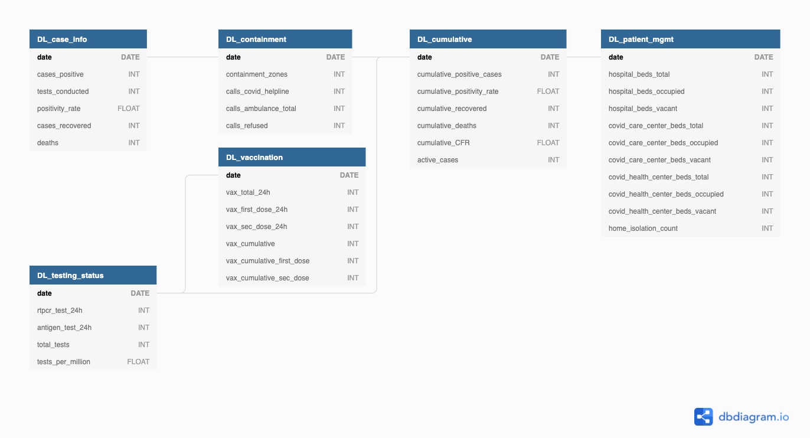

## Delhi (DL) database

<!-- @import "[TOC]" {cmd="toc" depthFrom=1 depthTo=6 orderedList=false} -->

### Schema

There are 6 tables containing information for Delhi. All the tables start with `DL`, and are connected to each other through the `date` column.

A brief description of these tables is as follows:

1. `DL_case_info`: Daily cases, recovered, and fatality information
2. `DL_cumulative`: Cumulative positive, recovered, and fatalities data
3. `DL_patient_mgmt`: Patient management table containing hospital occupany information
4. `DL_testing_status`: RTPCR / Rapid Antigen test information table
5. `DL_containment`: Containment zones, Ambulance calls, and helpline calls information
6. `DL_vaccination`: Vaccination information

