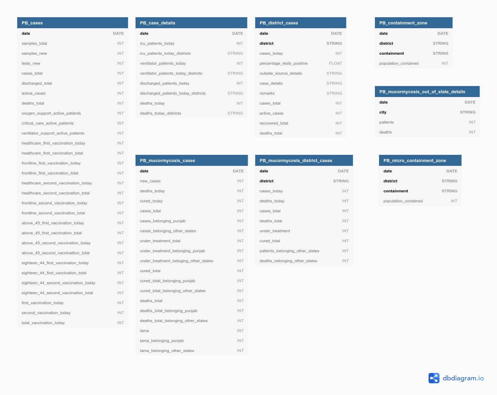

## Punjab (PB) database

<!-- @import "[TOC]" {cmd="toc" depthFrom=1 depthTo=6 orderedList=false} -->

### Schema

There are 8 tables containing information for the state of Punjab. All the tables start with `PB`, and are connected to each other through the `date` column.

A brief description of these tables is as follows:

1. `PB_cases`: Punjab samples, cases, and vaccination information. Table page 1.
2. `PB_case_details`: Punjab patients discharged, ventilators, icu and death details. Table page 1 or 2
3. `PB_district_cases`: Daily and total district wise info. Multiple tables starting on page 2 and continuing page 4 or 5.
4. `PB_containment_zone`: Details about larger containment zones, with population contained in each.  Table starting from Page 4 or 5 and can extend over multiple pages.
5. `PB_micro_containment`: Details about micro containment zones in a district, with population contained. Table starting on page 4 or 5 and can extend over multiple pages.
6. `PB_mucormycosis_cases`: Mucormycosis state-wide daily cases and cumulative information. Table on the second last page of the bulletin starting June 2021.
7. `PB_mucormycosis_district_details`: Mucormycosis district-wise detaiils for total cases, deaths, under treatment etc. Table on the last page of the bulletins from June 2021.
8. `PB_counselling`: Details of mucormycosis patients from out of state. Table on the last page of bulletins from June 2021. 

