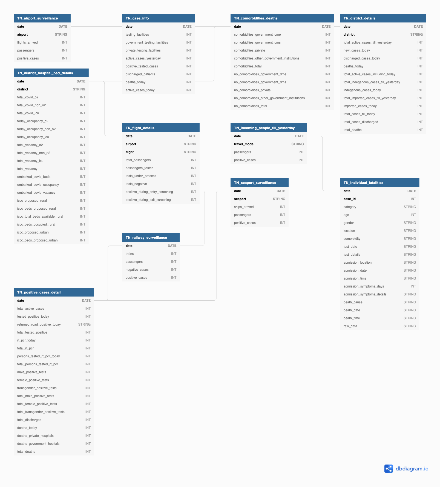

## Tamil Nadu (TN) database

<!-- @import "[TOC]" {cmd="toc" depthFrom=1 depthTo=6 orderedList=false} -->

### Schema

There are 10 tables containing information for the state of Tamil Nadu. All the tables start with `TN`, and are connected to each other through the `date` column.

A brief description of these tables is as follows:

1. `TN_case_info`: Daily cases info for the state
2. `TN_positive_cases_detail`: Positive case numbers, with total testing and categorization based on gender
3. `TN_district_details`: District wise daily numbers
4. `TN_district_hospital_bed_details`: District wise hospital bed availability
5. `TN_comorbidities_deaths`: Number of deaths due to comorbidities or not with categorization due to facility type, like at hospitals or private
6. `TN_incoming_people_till_yesterday`: Number of people travelling tested positive
7. `TN_airport_surveillance`: Testing details of domesting flights at 4 airports
8. `TN_flight_details`: Flight wise testing details
9. `TN_railway_surveillance`: Testing details of people travelling through train
10. `TN_seaport_surveillance`: Testing details of people travelling through ship
11. `TN_individual_fatalities`: Individual diagnosis data for each fatality due to COVID-19

