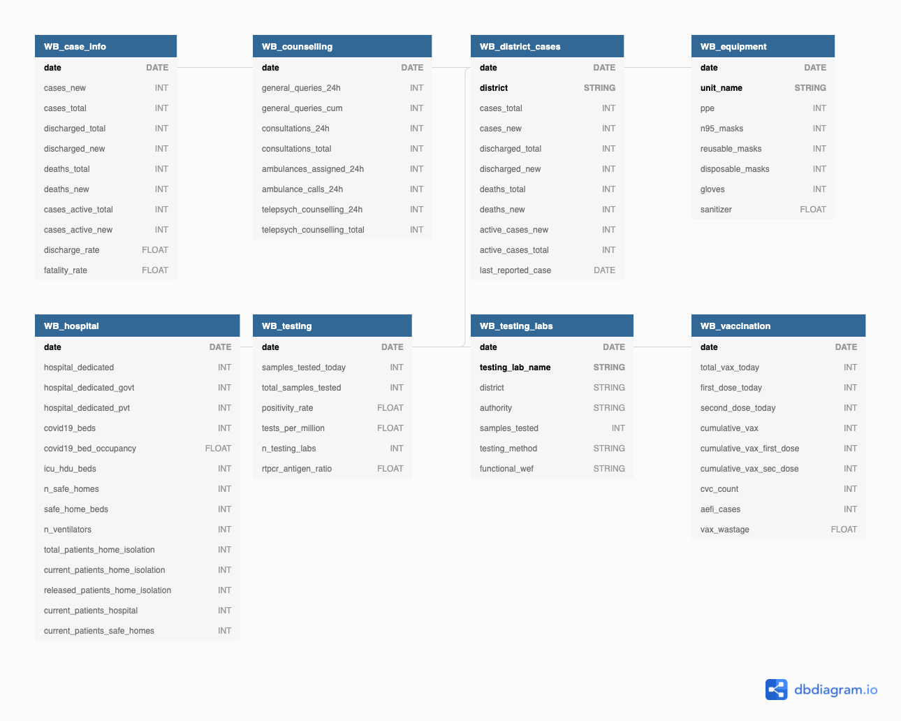

## West Bengal (WB) database

<!-- @import "[TOC]" {cmd="toc" depthFrom=1 depthTo=6 orderedList=false} -->

### Schema

There are 8 tables containing information for the state of West Bengal. All the tables start with `WB`, and are connected to each other through the `date` column.

A brief description of these tables is as follows:

1. `WB_case_info`: Daily and cumulative new cases, discharge, and fatality information
2. `WB_district_cases`: Daily and cumulative case, discharge, and fatality information for all districts in West Bengal state
3. `WB_testing`: Testing information for the state
4. `WB_hospital`: Hospital infrastructure, ICU, hospital beds, and home isolation patient numbers
5. `WB_testing_labs`: Information regarding testing lab in the state
6. `WB_vaccination`: Vaccination information for the state
7. `WB_equipment`: PPE, N95 masks, and gloves availability in the state
8. `WB_counselling`: Tele consulations, ambulance calls, and general query information

